[toc]


## 0. Hello,World

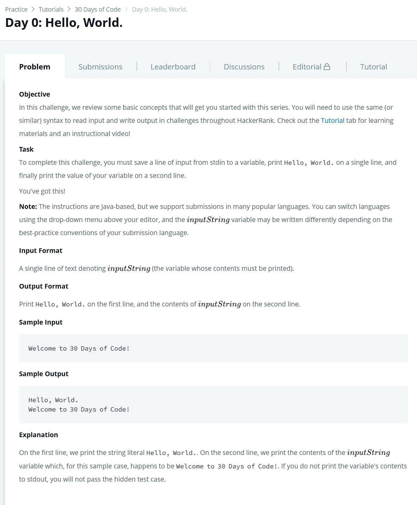

```java
import java.io.*;
import java.util.*;
import java.text.*;
import java.math.*;
import java.util.regex.*;
public class Solution {
	public static void main(String[] args) {
        // Create a Scanner object to read input from stdin.
		Scanner scan = new Scanner(System.in); 
		
		// Read a full line of input from stdin and save it to our variable, inputString.
		String inputString = scan.nextLine(); 

		// Close the scanner object, because we've finished reading 
        // all of the input from stdin needed for this challenge.
		scan.close(); 
      
		// Print a string literal saying "Hello, World." to stdout.
		System.out.println("Hello, World.");
        System.out.println(inputString);
	    // TODO: Write a line of code here that prints the contents of inputString to stdout.
	}
}
```

## 1. Data Types

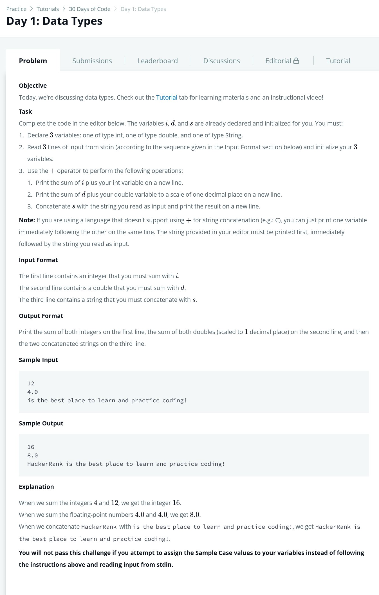

```java
import java.io.*;
import java.util.*;
import java.text.*;
import java.math.*;
import java.util.regex.*;

public class Solution {
	
    public static void main(String[] args) {
        int i = 4;
        double d = 4.0;
        String s = "HackerRank ";
		
        Scanner scan = new Scanner(System.in);

        /* Declare second integer, double, and String variables. */

        /* Read and save an integer, double, and String to your variables.*/
        // Note: If you have trouble reading the entire String, please go back and review the Tutorial closely.
        
        /* Print the sum of both integer variables on a new line. */

        /* Print the sum of the double variables on a new line. */
		
        /* Concatenate and print the String variables on a new line; 
        	the 's' variable above should be printed first. */
        
        int In1 = 0;
        double In2 = 0.0;
        String In3 = "";

        In1 = scan.nextInt();
        System.out.println(In1 + i);

        In2 = scan.nextDouble();
        System.out.println(In2 + d);

        In3 = s;
        while (scan.hasNextLine()) {
            In3 = In3 + scan.nextLine();
        }
        System.out.println(In3);

 
        scan.close();
    }
}
```

## 2. Operators

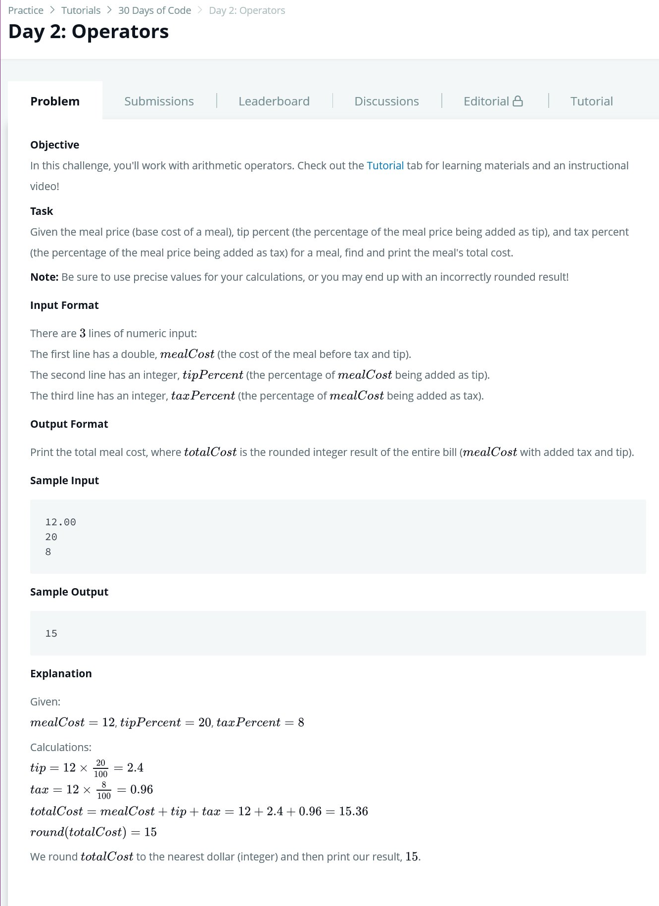

```java
import java.io.*;
import java.math.*;
import java.security.*;
import java.text.*;
import java.util.*;
import java.util.concurrent.*;
import java.util.regex.*;

public class Solution {

    // Complete the solve function below.
    static void solve(double meal_cost, int tip_percent, int tax_percent) {
        double Res = meal_cost*(1 + tip_percent/100.0 + tax_percent/100.0);
        System.out.print((int)Math.round(Res));
    }

    private static final Scanner scanner = new Scanner(System.in);

    public static void main(String[] args) {
        double meal_cost = scanner.nextDouble();
        scanner.skip("(\r\n|[\n\r\u2028\u2029\u0085])?");

        int tip_percent = scanner.nextInt();
        scanner.skip("(\r\n|[\n\r\u2028\u2029\u0085])?");

        int tax_percent = scanner.nextInt();
        scanner.skip("(\r\n|[\n\r\u2028\u2029\u0085])?");

        solve(meal_cost, tip_percent, tax_percent);
        scanner.close();
    }
}

```

## 3. Intro to Conditional Statements

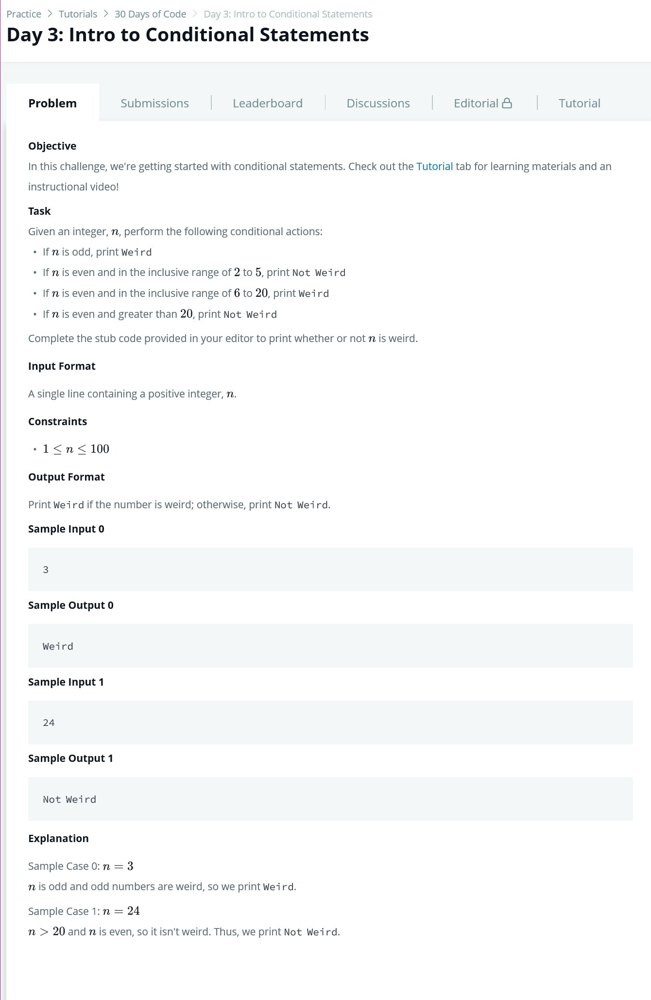

```java
import java.io.*;
import java.math.*;
import java.security.*;
import java.text.*;
import java.util.*;
import java.util.concurrent.*;
import java.util.regex.*;

public class Solution {


    private static final Scanner scanner = new Scanner(System.in);

    public static void main(String[] args) {
        int N = scanner.nextInt();
        scanner.skip("(\r\n|[\n\r\u2028\u2029\u0085])?");
        if(N%2==1)
            System.out.print("Weird");
        else{
            if(N>=2 && N<5)
                System.out.print("Not Weird");
            else if(N>=6 && N<=20)
                System.out.print("Weird");
            else if(N>20)
                System.out.print("Not Weird");
        }
        scanner.close();
    }
}

```

## 4. Class vs. Instance

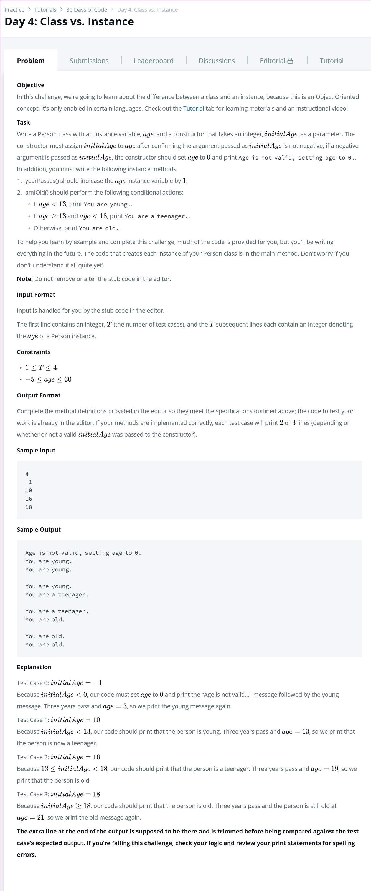

```java
import java.io.*;
import java.util.*;

public class Person {
    private int age;	

	public Person(int initialAge) {
  		// Add some more code to run some checks on initialAge
        if(initialAge<0 || initialAge>30)
        {
            initialAge = 0;
            System.out.println("Age is not valid, setting age to 0.");
        }
        age = initialAge;
	} 

	public void amIOld() {
  		// Write code determining if this person's age is old and print the correct statement:
        if(age<13)
            System.out.println("You are young.");   
        else if(age>=13 && age<18)
            System.out.println("You are a teenager.");  
        else
            System.out.println("You are old.");
	}

	public void yearPasses() {
  		// Increment this person's age.
          age++;
	}


	public static void main(String[] args) {
		Scanner sc = new Scanner(System.in);
		int T = sc.nextInt();
		for (int i = 0; i < T; i++) {
			int age = sc.nextInt();
			Person p = new Person(age);
			p.amIOld();
			for (int j = 0; j < 3; j++) {
				p.yearPasses();
			}
			p.amIOld();
			System.out.println();
        }
		sc.close();
    }
}
```

## 5. Loops

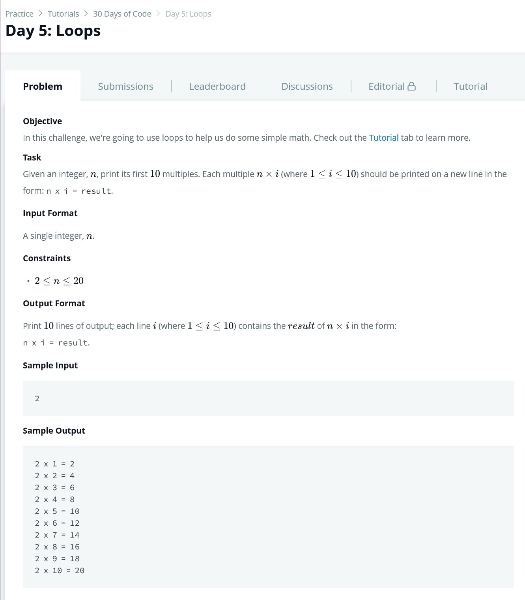

```java
import java.io.*;
import java.math.*;
import java.security.*;
import java.text.*;
import java.util.*;
import java.util.concurrent.*;
import java.util.regex.*;

public class Solution {


    private static final Scanner scanner = new Scanner(System.in);

    public static void main(String[] args) {
        int n = scanner.nextInt();
        scanner.skip("(\r\n|[\n\r\u2028\u2029\u0085])?");
        for(int i=1;i<=10;i++){
            System.out.println(n + " x " + i + " = " + n*i);
        }
        scanner.close();
    }
}

```

## 6. Let's Review

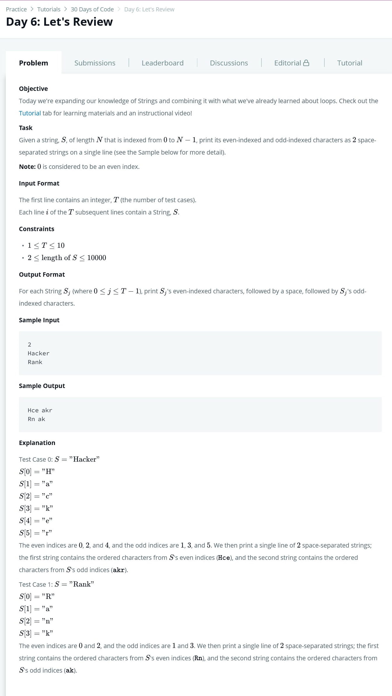

```python
# Enter your code here. Read input from STDIN. Print output to STDOUT

def ss_print(string):
    s_odd = s_even = ''
    for i in range(0,len(string)):
        if i%2 != 0 :
            s_odd = s_odd + string[i]
        if i%2 == 0 or i == 0:
            s_even = s_even + string[i]
        i = i + 1
    print(s_even + " " + s_odd)

ii = int(input())
for j in range(0,ii):
    s = input()
    ss_print(s)
```

## 7. Arrays

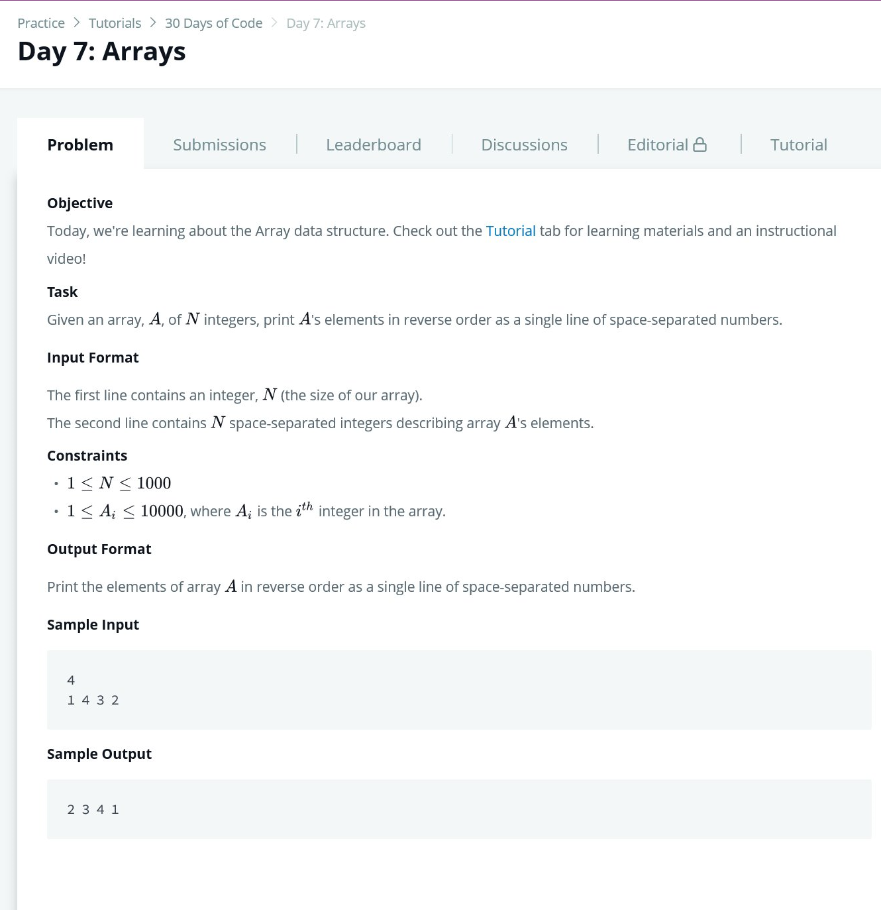

```Java
import java.io.*;
import java.math.*;
import java.security.*;
import java.text.*;
import java.util.*;
import java.util.concurrent.*;
import java.util.regex.*;

public class Solution {


    private static final Scanner scanner = new Scanner(System.in);

    public static void main(String[] args) {
        int n = scanner.nextInt();
        scanner.skip("(\r\n|[\n\r\u2028\u2029\u0085])?");

        int[] arr = new int[n];

        String[] arrItems = scanner.nextLine().split(" ");
        scanner.skip("(\r\n|[\n\r\u2028\u2029\u0085])?");

        for (int i = 0; i < n; i++) {
            int arrItem = Integer.parseInt(arrItems[i]);
            arr[n-i-1] = arrItem;
        }

        for(int j=0;j<n;j++){
            System.out.print(arr[j] + " ");
        }
        scanner.close();
    }
}
```

## 8.  Dictionaries and Maps

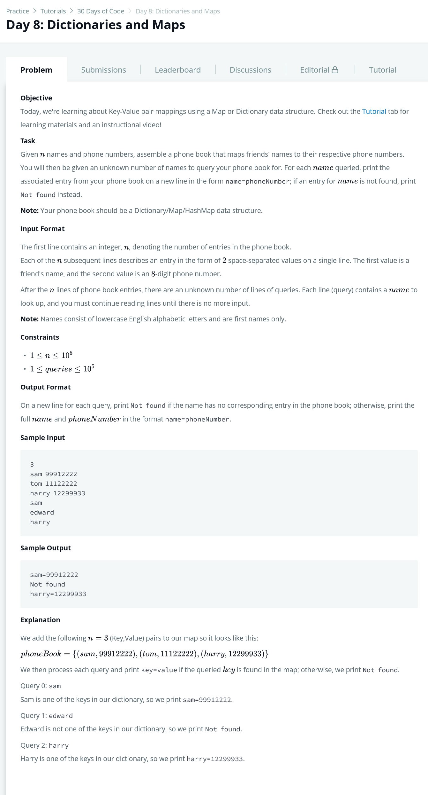

```java
//Complete this code or write your own from scratch
import java.util.*;
import java.io.*;

class Solution{
    public static void main(String []argh){
        Scanner in = new Scanner(System.in);
        HashMap<String,Integer> map = new HashMap();
        int n = in.nextInt();
        for(int i = 0; i < n; i++){
            String name = in.next();
            int phone = in.nextInt();
            // Write code here
            map.put(name,phone);
        }
        while(in.hasNext()){
            String s = in.next();
            // Write code here
            if (map.containsKey(s)){
                System.out.println(s + "=" + map.get(s));
            }
            else
                System.out.println("Not found");
        }
        in.close();
    }
}

```

## 9. Recursion 3

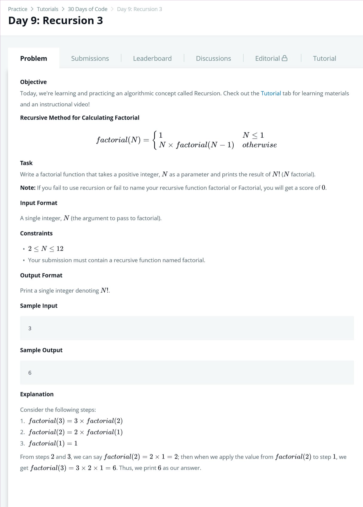

```java
import java.io.*;
import java.math.*;
import java.security.*;
import java.text.*;
import java.util.*;
import java.util.concurrent.*;
import java.util.regex.*;

public class Solution {

    // Complete the factorial function below.
    static int factorial(int n) {
        int result = 1;
        if(n>1)
        {
            result = n*factorial(n-1);
        }

        return result;
    }

    private static final Scanner scanner = new Scanner(System.in);

    public static void main(String[] args) throws IOException {
        BufferedWriter bufferedWriter = new BufferedWriter(new FileWriter(System.getenv("OUTPUT_PATH")));

        int n = scanner.nextInt();
        scanner.skip("(\r\n|[\n\r\u2028\u2029\u0085])?");

        int result = factorial(n);

        bufferedWriter.write(String.valueOf(result));
        bufferedWriter.newLine();

        bufferedWriter.close();

        scanner.close();
    }
}

```

## 10. Binary Numbers

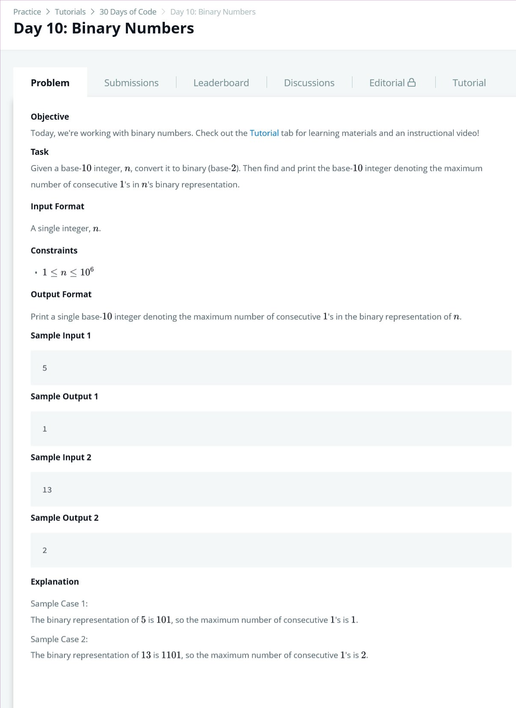

```java
import java.io.*;
import java.math.*;
import java.security.*;
import java.text.*;
import java.util.*;
import java.util.concurrent.*;
import java.util.regex.*;

public class Solution {


    private static final Scanner scanner = new Scanner(System.in);

    public static void main(String[] args) {
        int n = scanner.nextInt();
        scanner.skip("(\r\n|[\n\r\u2028\u2029\u0085])?");

        int temp = n;
        int count = 1;
        int count_max = 1;
        String res = "";
        

        while(temp!=0)
        {
            res = res + temp%2;
            temp = temp/2;  
        }
        

        for(int i=1;i<res.length();i++)
        {
            if(res.charAt(i)=='1' && res.charAt(i)==res.charAt(i-1))
                ++count;         
            else
                count = 1;
            
            if(count>count_max)
                count_max = count;
        }
            
        System.out.print(count_max);
        scanner.close();
    }
}

```


## 11. 2D Arrays

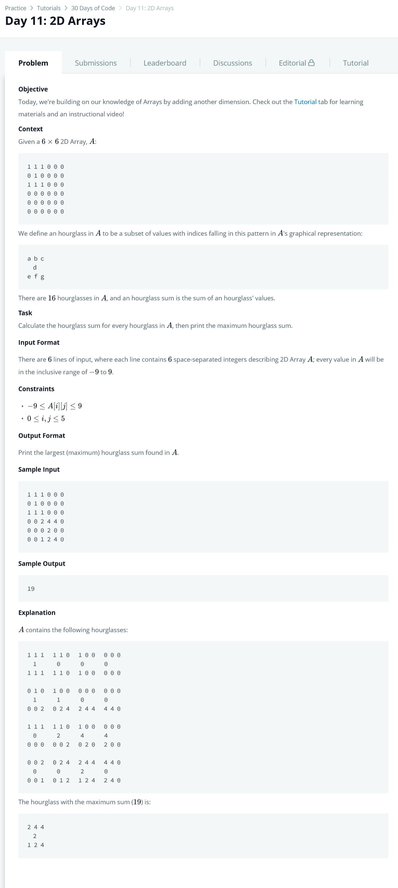

```java
import java.io.*;
import java.math.*;
import java.security.*;
import java.text.*;
import java.util.*;
import java.util.concurrent.*;
import java.util.regex.*;

public class Solution {


    private static final Scanner scanner = new Scanner(System.in);

    public static void main(String[] args) {
        int[][] arr = new int[6][6];
        // int[][] hG = new int[(6-2)*3][(6-2)*3];
        int SUM = 0;
        int SUM_MAX = -9*7;//注意不能初始化为0，因为和可能为负数

        for (int i = 0; i < 6; i++) {
            String[] arrRowItems = scanner.nextLine().split(" ");
            scanner.skip("(\r\n|[\n\r\u2028\u2029\u0085])?");

            for (int j = 0; j < 6; j++) {
                int arrItem = Integer.parseInt(arrRowItems[j]);
                arr[i][j] = arrItem;
            }
        }

        for(int m = 1; m < 5; m++)
        {
            for(int n =1; n<5; n++){
                // hG[3*(m-1)][3*(n-1)] = arr[m-1][n-1];
                // hG[3*(m-1)][3*(n-1)] = arr[m-1][n];
                // hG[3*(m-1)][3*(n-1)] = arr[m-1][n+1];
                // hG[3*(m-1)][3*(n-1)] = arr[m][n];
                // hG[3*(m-1)][3*(n-1)] = arr[m+1][n-1];
                // hG[3*(m-1)][3*(n-1)] = arr[m+1][n];
                // hG[3*(m-1)][3*(n-1)] = arr[m+1][n+1];
                SUM = arr[m-1][n-1] + arr[m-1][n] + arr[m-1][n+1] + arr[m][n] + arr[m+1][n-1] + arr[m+1][n] + arr[m+1][n+1];
                if(SUM >= SUM_MAX)
                    SUM_MAX = SUM; 
            }
        }

        System.out.print(SUM_MAX);

        scanner.close();
    }
}
```

## 12. Inheritance

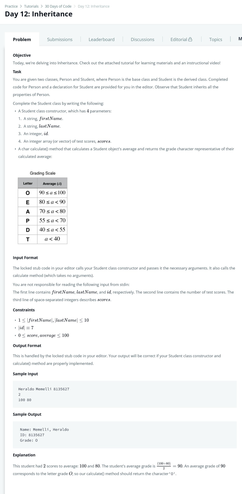

```java
import java.util.*;

class Person {
	protected String firstName;
	protected String lastName;
	protected int idNumber;
	
	// Constructor
	Person(String firstName, String lastName, int identification){
		this.firstName = firstName;
		this.lastName = lastName;
		this.idNumber = identification;
	}
	
	// Print person data
	public void printPerson(){
		 System.out.println(
				"Name: " + lastName + ", " + firstName 
			+ 	"\nID: " + idNumber); 
	}
	 
}

class Student extends Person{
	private int[] testScores;
    private int id;
    /*	
    *   Class Constructor
    *   
    *   @param firstName - A string denoting the Person's first name.
    *   @param lastName - A string denoting the Person's last name.
    *   @param id - An integer denoting the Person's ID number.
    *   @param scores - An array of integers denoting the Person's test scores.
    */
    // Write your constructor here

    public Student(String firstName,String lastName,int id,int[] scores){
        super(firstName,lastName,id);
        testScores = scores;
    } 

    /*	
    *   Method Name: calculate
    *   @return A character denoting the grade.
    */
    // Write your method here
    

    public char calculate(){
        int total = 0;
        for(int i = 0; i < testScores.length; i++)
            total = total + testScores[i];

        total = total/testScores.length;
        return ( total > 89 ? 'O' : 
                total > 79 ? 'E' : 
                total > 69 ? 'A' : 
                total > 54 ? 'P' :
                total > 39 ? 'D' : 'T' );
    }
}

class Solution {
	public static void main(String[] args) {
		Scanner scan = new Scanner(System.in);
		String firstName = scan.next();
		String lastName = scan.next();
		int id = scan.nextInt();
		int numScores = scan.nextInt();
		int[] testScores = new int[numScores];
		for(int i = 0; i < numScores; i++){
			testScores[i] = scan.nextInt();
		}
		scan.close();
		
		Student s = new Student(firstName, lastName, id, testScores);
		s.printPerson();
		System.out.println("Grade: " + s.calculate() );
	}
}
```


## 13. Abstract Classes

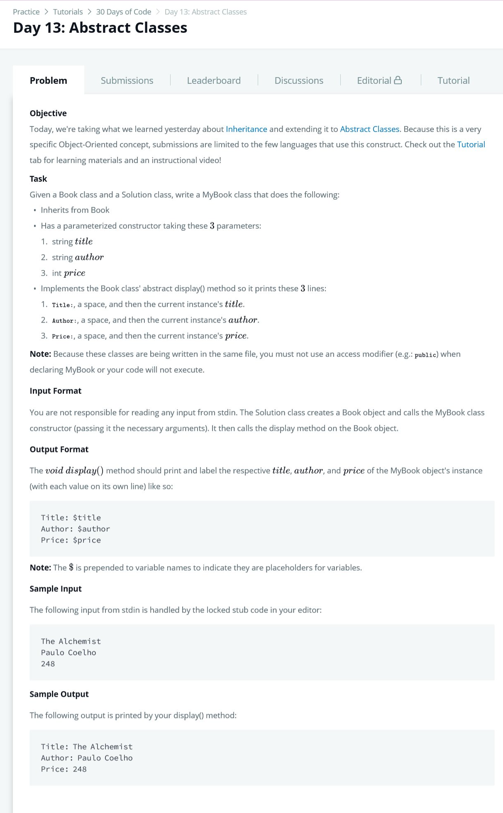

```java
import java.util.*;

abstract class Book {
    String title;
    String author;
    
    Book(String title, String author) {
        this.title = title;
        this.author = author;
    }
    
    abstract void display();
}

class MyBook extends Book{

    private int Price;

    MyBook(String title, String author, int price){
        super(title,author);
        Price = price;
    }

    public void display(){
        System.out.print("Title: " + title + "\nAuthor: " + author + "\nPrice: " + Price);
    } 
}
// Declare your class here. Do not use the 'public' access modifier.
    // Declare the price instance variable
    
    /**   
    *   Class Constructor
    *   
    *   @param title The book's title.
    *   @param author The book's author.
    *   @param price The book's price.
    **/
    // Write your constructor here
    
    /**   
    *   Method Name: display
    *   
    *   Print the title, author, and price in the specified format.
    **/
    // Write your method here
    
// End class

public class Solution {
   
    public static void main(String[] args) {
        Scanner scanner = new Scanner(System.in);
        String title = scanner.nextLine();
        String author = scanner.nextLine();
        int price = scanner.nextInt();
        scanner.close();

        Book book = new MyBook(title, author, price);
        book.display();
    }
}
```


## 14. Scope

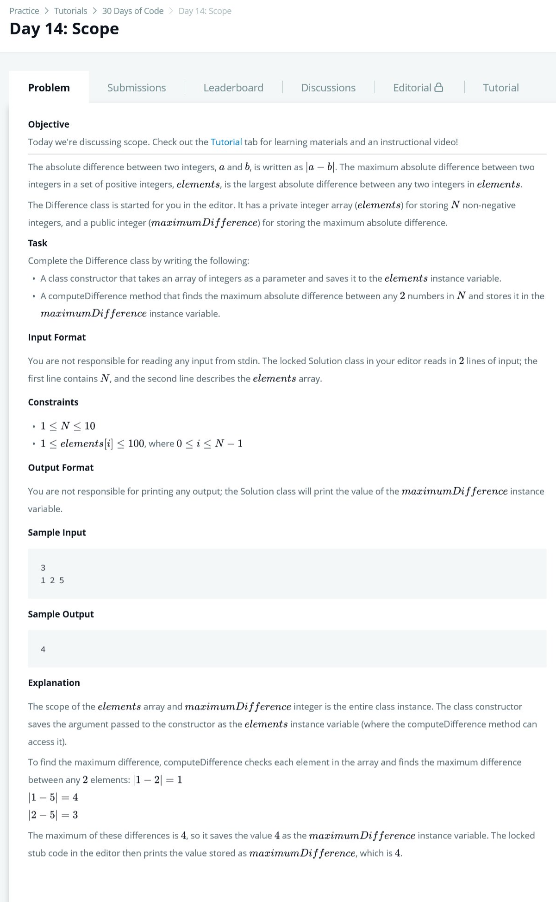

```java
import java.io.*;
import java.util.*;
import java.text.*;
import java.math.*;
import java.util.regex.*;


class Difference {
  	private int[] elements;
  	public int maximumDifference;

	// Add your code here
    Difference(int[] a){
        elements = a;
    }

    public int computeDifference(){
        int min=100;
        int max=1;

        for(int i=0;i<elements.length;++i)
        {
            if(elements[i]<min){min=elements[i];}
            if(elements[i]>max){max=elements[i];}
        }
        maximumDifference=max-min;
        return maximumDifference;
    }
    
} // End of Difference class

public class Solution {

    public static void main(String[] args) {
        Scanner sc = new Scanner(System.in);
        int n = sc.nextInt();
        int[] a = new int[n];
        for (int i = 0; i < n; i++) {
            a[i] = sc.nextInt();
        }
        sc.close();

        Difference difference = new Difference(a);

        difference.computeDifference();

        System.out.print(difference.maximumDifference);
    }
}
```

## 15.  Linked List

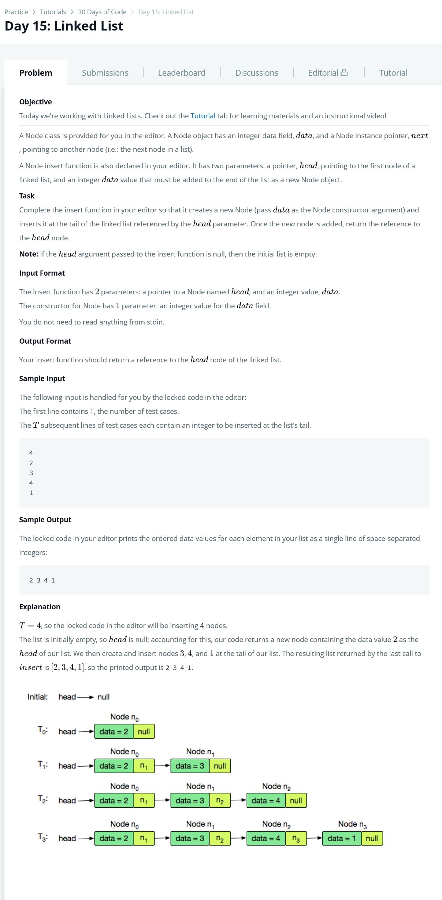

```java
import java.io.*;
import java.util.*;

class Node {
	int data;
	Node next;
	Node(int d) {
        data = d;
        next = null;
    }
}

class Solution {

    public static  Node insert(Node head,int data) {
        //Complete this method
        if(head == null)
            return new Node(data);
        else if(head.next == null)
            head.next = new Node(data);
        else
            insert(head.next,data);

        return head;                
            
    }

	public static void display(Node head) {
        Node start = head;
        while(start != null) {
            System.out.print(start.data + " ");
            start = start.next;
        }
    }

    public static void main(String args[]) {
        Scanner sc = new Scanner(System.in);
        Node head = null;
        int N = sc.nextInt();

        while(N-- > 0) {
            int ele = sc.nextInt();
            head = insert(head,ele);
        }
        display(head);
        sc.close();
    }
}
```


## 17. More Exceptions

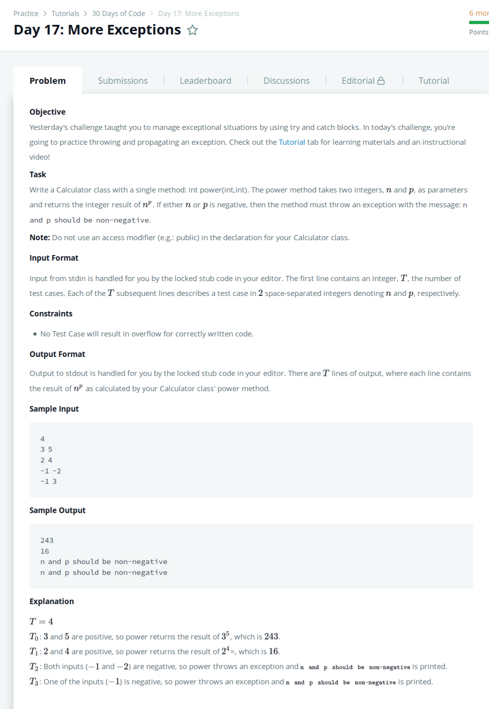

```java
import java.util.*;
import java.io.*;

//Write your code here
class Calculator {
    public int power(int n, int p)throws Exception{
        if(n < 0 || p < 0) {
           throw new Exception("n and p should be non-negative");
        }
        return (int)Math.pow(n, p);
    }
}

class Solution{

    public static void main(String[] args) {
    
        Scanner in = new Scanner(System.in);
        int t = in.nextInt();
        while (t-- > 0) {
        
            int n = in.nextInt();
            int p = in.nextInt();
            Calculator myCalculator = new Calculator();
            try {
                int ans = myCalculator.power(n, p);
                System.out.println(ans);
            }
            catch (Exception e) {
                System.out.println(e.getMessage());
            }
        }
        in.close();
    }
}
```

## 18. Queues and Stacks

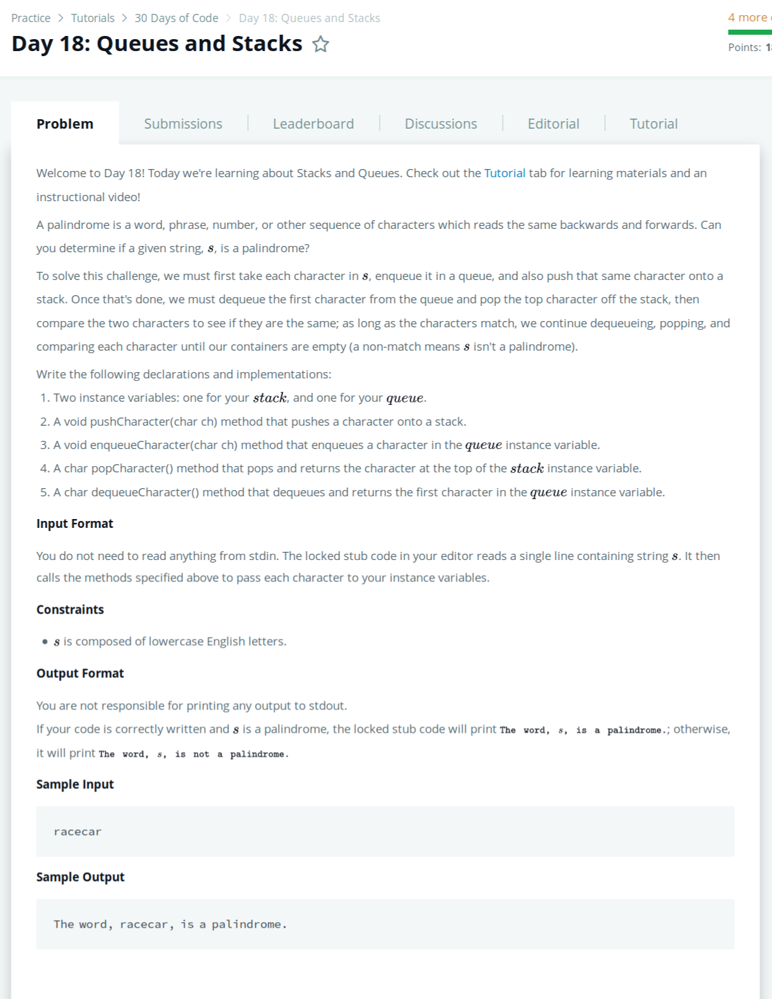

```java
import java.io.*;
import java.util.*;

public class Solution {
    // Write your code here.
    Stack<Character> stack = new Stack<>();
    Queue<Character> queue = new LinkedList<>();

    void pushCharacter(Character ch) {
        stack.push(ch);
    }

    void enqueueCharacter(char ch) {
        queue.add(ch);
    }

    char popCharacter(){
        return stack.pop();
    }

    char dequeueCharacter() {
        return queue.remove();
    }
    
    public static void main(String[] args) {
        Scanner scan = new Scanner(System.in);
        String input = scan.nextLine();
        scan.close();

        // Convert input String to an array of characters:
        char[] s = input.toCharArray();

        // Create a Solution object:
        Solution p = new Solution();

        // Enqueue/Push all chars to their respective data structures:
        for (char c : s) {
            p.pushCharacter(c);
            p.enqueueCharacter(c);
        }

        // Pop/Dequeue the chars at the head of both data structures and compare them:
        boolean isPalindrome = true;
        for (int i = 0; i < s.length/2; i++) {
            if (p.popCharacter() != p.dequeueCharacter()) {
                isPalindrome = false;                
                break;
            }
        }

        //Finally, print whether string s is palindrome or not.
        System.out.println( "The word, " + input + ", is " 
                           + ( (!isPalindrome) ? "not a palindrome." : "a palindrome." ) );
    }
}
```


## 19. Interfaces

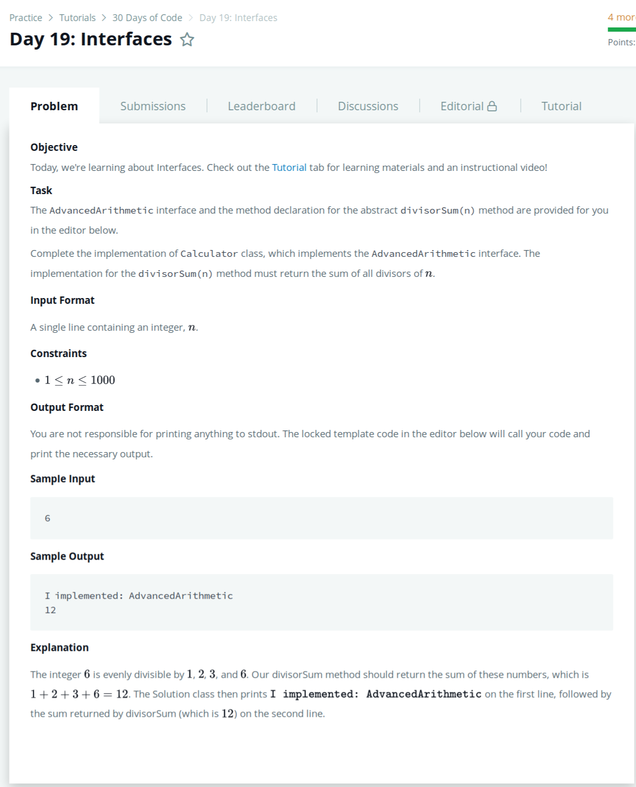

```java
import java.io.*;
import java.util.*;

interface AdvancedArithmetic{
   int divisorSum(int n);
}
class Calculator implements AdvancedArithmetic {
    public int divisorSum(int n) {
        int sum = 0;
        for(int i=1;i<=n;i++){
            for(int j=i;j<=n;j++){
                if(i*j==n){
                    if(i==j)
                        sum = sum + i;
                    else
                        sum = sum + i + j;  
                }      
            }
        }
    return sum;    
    }
}

class Solution {

    public static void main(String[] args) {
        Scanner scan = new Scanner(System.in);
        int n = scan.nextInt();
        scan.close();
        
      	AdvancedArithmetic myCalculator = new Calculator(); 
        int sum = myCalculator.divisorSum(n);
        System.out.println("I implemented: " + myCalculator.getClass().getInterfaces()[0].getName() );
        System.out.println(sum);
    }
}
```


